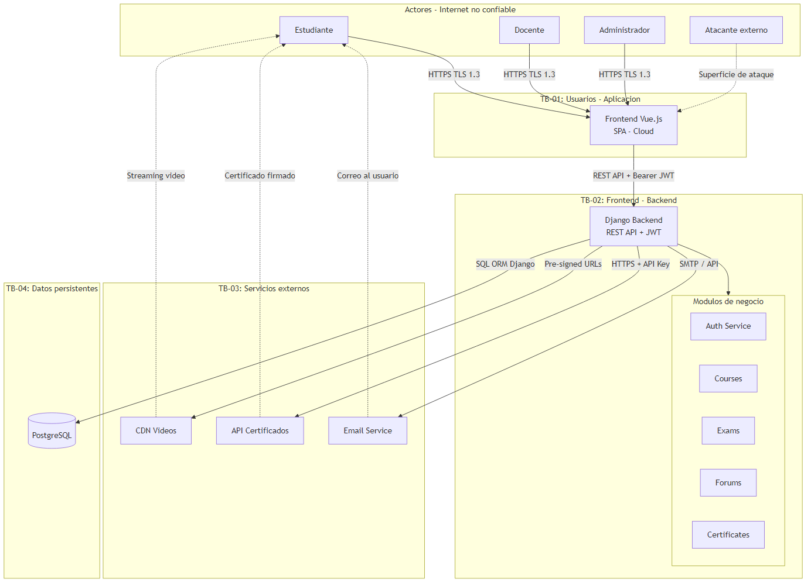

# 2. ARQUITECTURA DEL SISTEMA

## 2.1 Diagrama de Arquitectura

> Diagramas completos en la carpeta [`diagrams/`](../diagrams/):
> - [`arquitectura.png`](../diagrams/arquitectura.png) — exportación para presentación
> - [`arquitectura.svg`](../diagrams/arquitectura.svg) — exportación vectorial (draw.io)
> - [`arquitectura.drawio`](../diagrams/arquitectura.drawio) — editable en draw.io



### Vista simplificada (ASCII)

```text
  Estudiante / Docente / Administrador          Atacante externo
              │                                        │
              │ HTTPS / TLS 1.3                      │ (superficie de ataque)
              ▼                                        ▼
═══════════════════════════════════════════════════════════════
 TB-01  Usuarios ↔ Aplicación
═══════════════════════════════════════════════════════════════
              Frontend Vue.js (T01)
              │
              │ REST API + Bearer JWT
              ▼
═══════════════════════════════════════════════════════════════
 TB-02  Frontend ↔ Backend
═══════════════════════════════════════════════════════════════
              Django Backend (T02)
              ├── Auth Service (T04)
              ├── Courses / Exams / Forums (T05)
              └── Certificates
         ┌────┴────┬──────────────┐
         │         │              │
         ▼         ▼              ▼
═══════════════════════════════════════════════════════════════
 TB-03  Servicios Externos              TB-04  Datos Persistentes
═══════════════════════════════════════════════════════════════
  CDN Videos (T06)                       PostgreSQL (T03)
  API Certificados (T07)                 A01–A06, A09, A10
  Email Service (T08)
```

## 2.2 Flujo de Datos

### Realización de un examen

Estudiante → Frontend → Backend → PostgreSQL

### Visualización de contenido

Estudiante → Frontend → CDN

### Emisión de certificado

Docente → Backend → API Certificados → Estudiante

## 2.3 Actores del Sistema

| Actor            | Descripción                           | Privilegios |
| ---------------- | ------------------------------------- | ----------- |
| Estudiante       | Consume cursos y realiza evaluaciones | Limitados   |
| Docente          | Gestiona cursos y exámenes            | Elevados    |
| Administrador    | Administra la plataforma              | Completos   |
| Atacante Externo | Actor malicioso                       | Ninguno     |


## 2.4 Trust Boundaries

### TB-01 Usuarios ↔ Aplicación

Representa el ingreso de tráfico desde Internet. Los usuarios no son considerados confiables.

### TB-02 Frontend ↔ Backend

Representa la comunicación entre cliente y servidor. Deben aplicarse controles de autenticación y autorización.

### TB-03 Backend ↔ Servicios Externos

Corresponde a la interacción con sistemas fuera del control directo de la organización.

### TB-04 Backend ↔ Base de Datos

Contiene los activos más sensibles de la plataforma y requiere controles estrictos de acceso.

## 2.5 Supuestos funcionales
* La plataforma ofrece cursos online.
* Los usuarios pueden registrarse y autenticarse.
* Existen roles de Estudiante, Docente y Administrador.
* Se emiten certificados de finalización.
* Los cursos contienen videos y documentos.
* Existen foros de discusión.